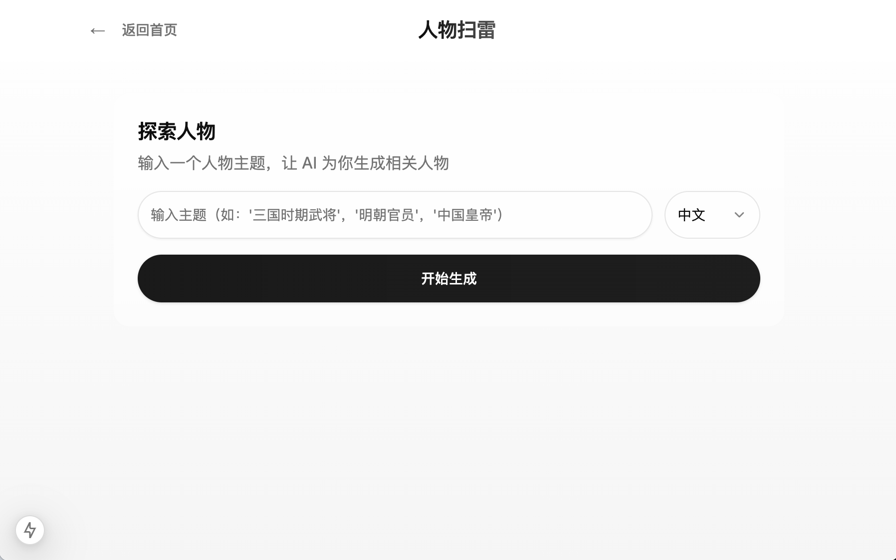
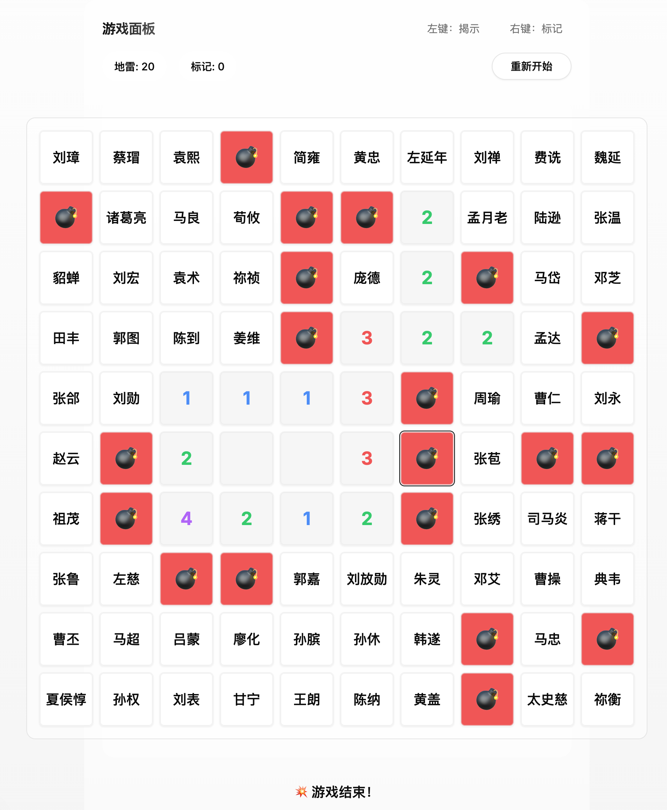

# 人物扫雷

[English](./README.md) | [简体中文](./README.zh-CN.md)

一个独特的扫雷游戏，让你探索 AI 为你生成的人物世界。输入任何你感兴趣的主题，AI 将智能生成相关人物和迷惑选项。在游戏过程中，发现并了解与你所选主题相关的人物。

## 特性

- 🎮 经典扫雷玩法（10x10 网格，20 个地雷）
- 🤖 基于 Claude（通过 OpenRouter）的 AI 概念生成
- 👤 基于人物的概念映射：
  - 80 个安全格子（人物相关概念）
  - 20 个地雷格子（人物无关概念）
- 🎯 交互式游戏体验：
  - 左键点击揭示格子
  - 右键点击放置/移除旗帜
  - 悬停显示已揭示格子的概念
  - 颜色编码的相邻地雷数字
- 🌏 多语言支持（中文/英文）
- 📱 响应式设计，适配多种屏幕尺寸

## 演示视频

https://github.com/user-attachments/assets/61dd1a92-8a8c-4596-ab0c-fa93587e972f

## 游戏截图

以下是游戏界面的一些截图：

### 首页

*可以开始新游戏的登录页面*

### 人物输入

*输入你选择的人物并选择语言*

### 游戏进行中

*显示已揭示格子和旗帜的游戏画面*

### 游戏结束

*显示所有格子的游戏结束画面*

## 技术栈

- **前端框架**：Next.js 14（App Router）
- **样式**：Tailwind CSS + shadcn/ui
- **状态管理**：React hooks（useState + useCallback）
- **AI 集成**：OpenRouter API with Claude
- **开发语言**：TypeScript

## 环境要求

开始之前，请确保你有：
- Node.js 18.17 或更高版本
- pnpm 8.0 或更高版本
- OpenRouter API 密钥（在 https://openrouter.ai 获取）

## 快速开始

1. 克隆仓库：
```bash
git clone https://github.com/yourusername/YYMinesweeper.git
cd sweeper
```

2. 安装依赖：
```bash
pnpm install
```

3. 启动开发服务器：
```bash
pnpm dev
```

4. 在浏览器中打开 [http://localhost:3000](http://localhost:3000)

## 游戏玩法

1. 输入你的 OpenRouter API 密钥
2. 输入一个你选择的人物（如"福尔摩斯"、"居里夫人"）
3. 选择你偏好的语言（中文/英文）
4. 等待 AI 生成人物相关概念
5. 开始游戏：
   - 左键点击揭示格子
   - 右键点击放置/移除旗帜
   - 数字显示相邻地雷数量
   - 悬停查看已揭示格子的概念
   - 标记所有地雷并揭示所有安全格子即可获胜

## 项目结构

```
src/
├── app/                 # Next.js app router 页面
├── components/         # React 组件
│   ├── ui/            # shadcn/ui 组件
│   ├── game-board/    # 游戏面板和格子组件
│   └── api-key-dialog # API 密钥管理
├── lib/               # 工具和 API 集成
└── types/             # TypeScript 类型定义
```

## 开发状态

### 已完成
- ✅ 核心扫雷机制
- ✅ AI 概念生成
- ✅ 基于人物的游戏玩法
- ✅ 多语言支持
- ✅ 基础 UI/UX 实现

### 计划功能
- ⏳ 难度级别
- ⏳ 人物保存
- ⏳ 统计追踪
- ⏳ 音效
- ⏳ 深色模式

## 参与贡献

1. Fork 本仓库
2. 创建你的特性分支（`git checkout -b feature/amazing-feature`）
3. 提交你的更改（`git commit -m 'Add some amazing feature'`）
4. 推送到分支（`git push origin feature/amazing-feature`）
5. 开启一个 Pull Request

## 许可证

本项目基于 MIT 许可证 - 查看 LICENSE 文件了解详情。

## 致谢

- 使用 [Next.js](https://nextjs.org) 构建
- UI 组件来自 [shadcn/ui](https://ui.shadcn.com)
- AI 支持来自 [Claude](https://anthropic.com/claude)（通过 [OpenRouter](https://openrouter.ai)） 